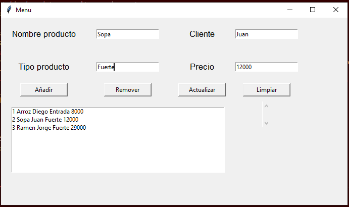

# Control de Pedidos para Restaurante 

# Introducción

Este proyecto es una GUI de una CRUD hecha en Python, manejada en SQLite, pensada para ayudar a 
algún restaurante (en este caso Osaki) a administrar los pedidos 
que hacen en el día a día. 

## Tecnología utilizada

**Interfaz:** Python

**Sistema de Gestión DB:** SQLite Studio

## Autor

- [@diegonzalez36](https://www.github.com/diegonzalez36)

## Screenshots

## Funciones

- **Añadir**
Añade algún registro de datos ingresado en las entrys.
- **Remover**
Remueve algún registro de la base de datos.
- **Actualizar**
Actualiza los datos en la base de datos con los que estan en las entrys.
- **Limpiar**
Limpia el texto que se encuentre en las entrys.

